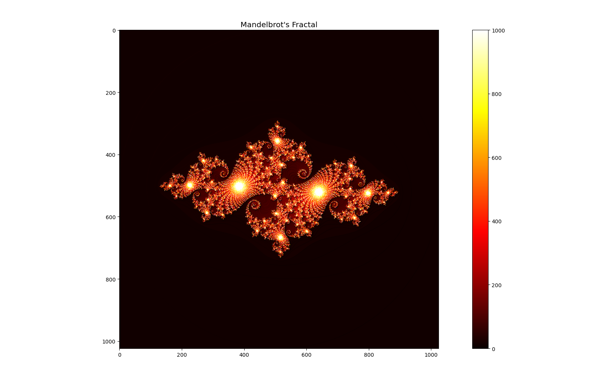

# Escape Time Fractal

The simplest algorithm for generating visual representations of the Mandelbrot set is the escape-time algorithm. 


## Description


This method repeatedly evaluates a calculation for each coordinate (x, y) within the plotting domain, assigning pixel colors based on the behavior of the resulting orbit sequence. Essentially, the algorithm tracks the number of iterations required to detect divergence of the orbit {z₀, z₁, z₂, …, zₙ}. Mathematical analysis confirms that if any point zₙ surpasses a predefined boundary region R, the orbit will inevitably diverge toward infinity. Although the exact geometry and minimum dimensions of R depend on the fractal type, the Mandelbrot set conventionally employs a circle centered at the origin with radius 2, as exceeding |z| > 2 ensures divergence.

In practice, the iteration count n at which the sequence exits R determines the coloring value. This approach inherently limits iterations, preventing infinite loops during computation. While mathematical rigor dictates a boundary of radius 2, creative adaptations involving varied shapes—such as ellipses, triangles, or stars—and smaller radii are frequently explored for artistic experimentation.


## Executing program
Program parameters:
* `cx`: initial x value.
* `cy`: initial y value.
* `size`: grid size of the plot.
* `output_file`: name given by the user for the output data file.
* `Parallel Mode`: 0 for sequential or 1 for parallel.
  
Open the terminal in the directory containing the program Escape_Time.exe and run the command: 
```
./Escape_Time <cx> <cy> <size> <output_file> <0-seq or 1-pal>
```
For example: 
```
./Escape_Time 0.2932 -0.6843 4096 output_data.dat 1
```
The program will produce a binary file "output_data.dat": 
## Ploting the Fractal
To plot the fractal graph, the user can user execute the command line 
```
python3 plot.py output_data.dat 
```

## Authors

Adrian Batista
ex. [@DomPizzie](https://twitter.com/dompizzie)

## Acknowledgments
- Roberto Carlos Cruz


