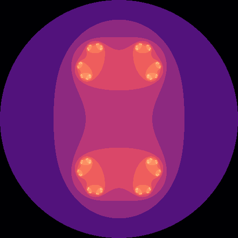

# Escape Time Fractal

The escape-time algorithm for generating visual representations of a **Julia set**.



*The constant `c` swept once around the circle `|c| = 0.7885`, morphing the Julia set from connected shapes to dendrites and dust.*

## Description

This method repeatedly evaluates a calculation for each coordinate (x, y) within the plotting domain, assigning a value to each pixel based on the behavior of the resulting orbit sequence. The algorithm tracks the number of iterations required to detect divergence of the orbit {z₀, z₁, z₂, …, zₙ}. Mathematical analysis confirms that if any point zₙ surpasses a predefined boundary region R, the orbit will inevitably diverge toward infinity. For the standard quadratic map the boundary is a circle centered at the origin with radius 2, as exceeding |z| > 2 guarantees divergence. The iteration count *n* at which the orbit exits R (capped at a maximum) becomes the stored value.

This program iterates `zₙ₊₁ = zₙ² + c` starting from `z₀ = (x, y)` (the pixel) with a **fixed** constant `c = (cx, cy)`. Because the starting point varies per pixel while `c` is constant, the result is the **Julia set** for `c`. (The Mandelbrot set is the complementary case: fix `z₀ = 0` and vary `c` per pixel.)

## Building

Requires a C++17 compiler and CMake ≥ 3.16. MPI, OpenMP, and TBB are **optional** — CMake enables each backend only if its library is found, so the program builds even if some are missing.

```
cmake -S . -B build
cmake --build build
```

Optional dependencies (Debian/Ubuntu):

```
sudo apt install libopenmpi-dev libtbb-dev    # MPI + TBB backends
# OpenMP ships with GCC/Clang
```

## Running

Program parameters:
* `cx`: real part of the Julia constant *c*.
* `cy`: imaginary part of the Julia constant *c*.
* `size`: grid size of the plot (produces a `size × size` image; must be 1–20000).
* `output_file`: name of the output data file.
* `mode`: `0` = sequential, `1` = TBB parallel, `2` = OpenMP.

From the directory containing the built `Escape_Time` executable:

```
./Escape_Time <cx> <cy> <size> <output_file> <mode>
```

For example (OpenMP):

```
./Escape_Time 0.2932 -0.6843 4096 fractal.dat 2
```

### Parallel execution

* **OpenMP** (threads on one machine): use `mode 2` and set the thread count with
  `OMP_NUM_THREADS`, e.g. `OMP_NUM_THREADS=8 ./Escape_Time 0.2932 -0.6843 4096 fractal.dat 2`.
* **MPI** (multiple processes / nodes): launch with `mpirun`. The image rows are
  split across ranks and gathered on rank 0, which writes the file.
* **Hybrid MPI + OpenMP**: combine both — each rank threads over its rows:

  ```
  OMP_NUM_THREADS=4 mpirun -n 4 ./Escape_Time 0.2932 -0.6843 4096 fractal.dat 2
  ```

The program writes `output_file` as a raw, row-major, little-endian `uint32`
grid (one iteration count per pixel).

## Producing a FITS image

Convert the raw data into a standard [FITS](https://fits.gsfc.nasa.gov/) file
(viewable in DS9, astropy, ImageJ, …):

```
python3 to_fits.py fractal.dat fractal.fits
```

Requires `astropy` (`pip install astropy`).

## Plotting (optional)

To quickly preview the fractal as a shaded picture:

```
python3 plot.py fractal.dat
```

Requires `numpy` and `matplotlib`. Options: `--cmap`, `--log`, `--save_img out.png`, `--title`.

## Animation

The header GIF is produced by sweeping the constant `c` once around a circle
(seamless loop). Each frame is computed by the `Escape_Time` binary and coloured
with a fixed palette:

```
python3 make_gif.py --bin ./build/Escape_Time --out assets/Fractal.gif
```

Requires `numpy`, `matplotlib`, and `Pillow`. Options: `--size`, `--frames`,
`--radius`, `--cmap`, `--duration`.

## Authors

Adrian Batista
[LinkedIn](https://www.linkedin.com/in/adrian-batista-aab275169)

## Acknowledgments
- Roberto Carlos Cruz
